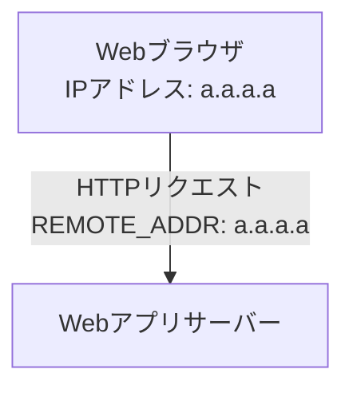
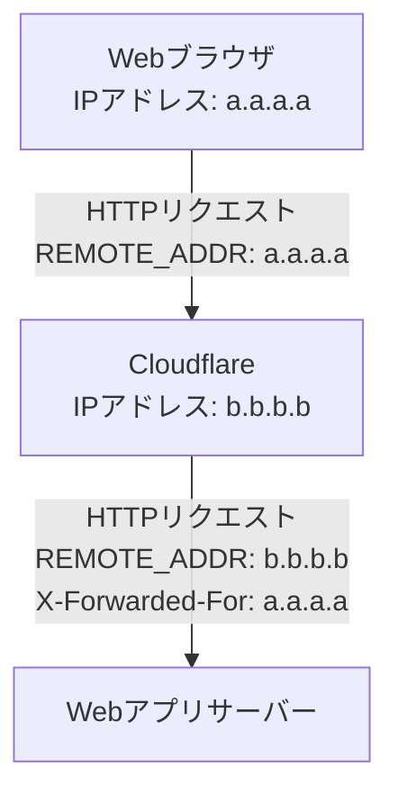
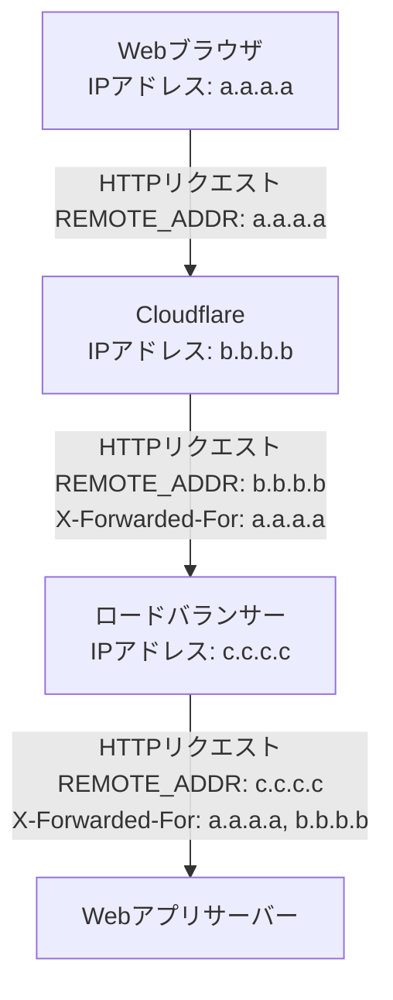
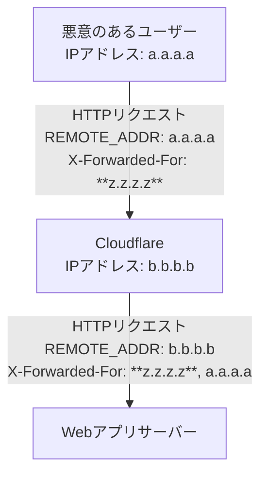

import MermaidClient from "../../components/MermaidClient.astro";

<MermaidClient />

## 面倒くさがりな人向けの要約

もしあなたが Misskey サーバーを Cloudflare 経由で公開している場合、`.config/default.yml` の trustProxy オプションには [Cloudflare の全ての IP アドレスレンジ](https://www.cloudflare.com/ips/)を指定してください。以上。

## 前置き

Misskey v2025.12.0 から、従来のデフォルトの設定値が原因となったセキュリティ上の問題 ([GHSA-wwrj-3hvj-prpm](https://github.com/misskey-dev/misskey/security/advisories/GHSA-wwrj-3hvj-prpm)) の対策として trustProxy のデフォルト値が厳格化されました。

この trustProxy にはサーバー管理者がその構成に応じて適切な値を設定する必要があり、全ての環境でこの設定にしておけば OK といえるような単純な設定値は存在しません。
今の Misskey のデフォルト値はあくまで安全側に寄せたものであり、例えば Cloudflare 経由で Misskey を公開している場合にデフォルト値をそのまま使用していると意図しないレートリミットエラーにより正当なユーザーからのアクセスがブロックされてしまう可能性があります。

trustProxy の設定に何を書けばよいかは `.config/example.yml` の[コメント](https://github.com/misskey-dev/misskey/blob/2025.12.2/.config/example.yml#L108-L154)で説明されていますが、そもそも trustProxy がどのような問題を解決したいのかの背景を理解していないと適切な設定値をイメージしづらいのではないかと思います。

そこで、一般的な Web アプリにおける `X-Forwarded-For` の仕組みの解説と、それを踏まえて Misskey の trustProxy オプションがどのように動作するのかを解説したいと思います。

## X-Forwarded-For の仕様のおさらい

そもそもサーバーサイドで動く Web アプリはどのようにアクセス元の IP アドレスを認識しているのでしょうか？
それを理解するためには HTTP リクエストヘッダーに含まれる [`X-Forwarded-For` フィールド](https://developer.mozilla.org/ja/docs/Web/HTTP/Reference/Headers/X-Forwarded-For)の仕組みを理解する必要があります。

### その1: Web サーバーに直接アクセス可能な場合

まずは、Web サーバーを起動してそこに直接ブラウザでアクセスするようなシンプルなパターンから考えてみましょう。ここではまだ `X-Forwarded-For` フィールドは登場しません。



本当にシンプルですね。これで十分だと思っていた頃が私にもありました。
レンタルサーバーを借りて掲示板 CGI を動かしていた頃はこんな感じだったんじゃないかと思います。
この図における `REMOTE_ADDR` というのは CGI の仕様で定義[^1]されている環境変数の一つで、アクセス元の IP アドレスが格納されています。
つまり、この構成において Web アプリがアクセス元の IP アドレスを知りたい場合は、この `REMOTE_ADDR` の値を参照すれば良いわけです。

なお、Misskey のような Node.js で動くアプリでは FastCGI の仕組みを使用していないため正確には `REMOTE_ADDR` ではなく `req.ip` などのプロパティを使用しますが、用語として便利なので以後も `REMOTE_ADDR` と呼ぶことにします。

[^1]: [RFC 3875 - The Common Gateway Interface (CGI) Version 1.1](https://datatracker.ietf.org/doc/html/rfc3875) の [Section 4.1.8](https://datatracker.ietf.org/doc/html/rfc3875#section-4.1.8) で定義

### その2: リバースプロキシの背後にある場合

現代の Web アプリケーションは先ほどの例のようなシンプルな構成で動作しているとは限りません。
多くの場合、Web アプリケーションはリバースプロキシサーバーやロードバランサーの背後で動作しています。
例えば nginx をリバースプロキシとして使用している場合や、Cloudflare のような CDN サービスを利用している場合が当てはまります。



この図の場合、直接 Web アプリサーバーに接続してくるのは Cloudflare のサーバーです。そのため、`REMOTE_ADDR` には Cloudflare の IP アドレスが設定されることになります。
しかし Web アプリが知りたい情報は Cloudflare の IP アドレスではなく、その更に手前にあるエンドユーザーの IP アドレスのはずです。
なぜなら、アクセス元 IP アドレスを取得した Web アプリはその情報を元にアクセスログの記録やレートリミット制限を行いたいのに、どの環境からアクセスしてきても常に Cloudflare の IP アドレスが記録されてしまっては意味がないからです。

そこで、Cloudflare を含むリバースプロキシは通常、オリジンサーバー（Web アプリサーバー）にリクエストを転送する際に `X-Forwarded-For` フィールドを自動で加えます。
このフィールドの値には、リバースプロキシに接続してきたクライアントの IP アドレスが設定されます。
リバースプロキシの背後にある Web アプリは、この `X-Forwarded-For` フィールドを参照することで本来知りたかったアクセス元 IP アドレスを取得することができるわけです。

### その3: さらに多段のリバースプロキシが存在する場合

より複雑な構成を考えてみましょう。ネットワークの構成によっては複数段のリバースプロキシが存在する場合もあります。このような場合は、`X-Forwarded-For` フィールドの値の末尾にカンマ区切りで IP アドレスが追加されていきます。



このような場合は、`X-Forwarded-For` フィールドの値から `b.b.b.b` の部分を除いた `a.a.a.a` が本来のアクセス元 IP アドレスであると認識することができます。

## X-Forwarded-For の罠

ここまでで `X-Forwarded-For` フィールドの用途とその挙動について理解できたと思います。
あとは Web アプリがユーザーの IP アドレスを取得するために何をすればいいか分かりますね？

「`X-Forwarded-For` フィールドの値を見て、カンマ区切りの一番左側に書かれている IP アドレスを取得すればいい」

はい、**不正解**です！！！

`X-Forwarded-For` フィールドはリバースプロキシが自動で追加してくれるものですが、ユーザー側からも送信することが可能なフィールドでもあります。
つまり、悪意のあるユーザーが自分の IP アドレスを偽装するために `X-Forwarded-For` フィールドを好き勝手に設定してリクエストを送信してくる可能性も考慮しなければなりません。

例えば以下のような状況を考えてみましょう。悪意のあるユーザーが、リクエストヘッダーに自ら `X-Forwarded-For: z.z.z.z` を設定することでアクセス元を偽装しようとしています。



困ったことになりました。この場合、Web アプリが受け取るリクエストの `X-Forwarded-For` フィールドの一番左側に書かれている IP アドレスは `z.z.z.z` であり、これは悪意のあるユーザーがアクセス元を偽装するために設定した IP アドレスです。
もし Web アプリが `X-Forwarded-For` フィールドの一番左側の値を単純にアクセス元 IP アドレスとして扱ってしまうと、悪意のあるユーザーによるアクセス元の偽装を許してしまうことになります。

実際のところ、このような `X-Forwarded-For` フィールドの解釈に関する脆弱性は様々な Web アプリケーションで報告されており、Misskey や Mastodon からは以下のようなセキュリティアドバイザリが公開されています。

- Mastodon
  - [2024-05-30] Bypassing rate limiting with X-Forwarded-For header · Advisory · mastodon/mastodon<br/>
    https://github.com/mastodon/mastodon/security/advisories/GHSA-c2r5-cfqr-c553
- Misskey
  - [2025-12-13] Login rate limit bypass via spoofed X-Forwarded-For header. · Advisory · misskey-dev/misskey<br/>
    https://github.com/misskey-dev/misskey/security/advisories/GHSA-wwrj-3hvj-prpm

## Misskey に導入された trustProxy オプション

このような状況に対応するために Misskey v2025.9.1-alpha.1 から `trustProxy` という設定項目が導入されました ([#16567](https://github.com/misskey-dev/misskey/pull/16567))

この `trustProxy` に指定できる値の形式は Misskey 内部で使用している Fastify の [trustProxy](https://fastify.dev/docs/v5.7.x/Reference/Server/#trustproxy) オプションと同一です。
これを適切に設定することで `X-Forwarded-For` フィールドの値をどこまで信用するかを制御できます。
指定できる値の形式にはいくつかのパターンがあるので実際の例を見ていきましょう。

### trustProxy に IP アドレス (CIDR形式) の配列を指定するパターン

Misskey のデフォルトの設定値は以下のように `trustProxy` を記述した場合と同じです。

```yaml
trustProxy:
  - "10.0.0.0/8"
  - "172.16.0.0/12"
  - "192.168.0.0/16"
  - "127.0.0.1/32"
  - "::1/128"
  - "fc00::/7"
```

この設定で、例えば `X-Forwarded-For: a.a.a.a, b.b.b.b, 10.0.0.1` を含んだリクエストを受信した場合には `10.0.0.1` は信頼できるリバースプロキシとして認識されるため、その直前にある `b.b.b.b` がアクセス元 IP アドレスとして扱われます。

もし Cloudflare を使用している構成であれば、以下のように Cloudflare の IP アドレスレンジを追加すると良いでしょう。
これらの IP アドレスは https://www.cloudflare.com/ips/ で公開されています。

```yaml
trustProxy:
  - "10.0.0.0/8"
  - "172.16.0.0/12"
  - "192.168.0.0/16"
  - "127.0.0.1/32"
  - "::1/128"
  - "fc00::/7"
  # Cloudflare の IP アドレス（2026-02-07 時点）
  - "173.245.48.0/20"
  - "103.21.244.0/22"
  - "103.22.200.0/22"
  - "103.31.4.0/22"
  - "141.101.64.0/18"
  - "108.162.192.0/18"
  - "190.93.240.0/20"
  - "188.114.96.0/20"
  - "197.234.240.0/22"
  - "198.41.128.0/17"
  - "162.158.0.0/15"
  - "104.16.0.0/13"
  - "104.24.0.0/14"
  - "172.64.0.0/13"
  - "131.0.72.0/22"
  - "2400:cb00::/32"
  - "2606:4700::/32"
  - "2803:f800::/32"
  - "2405:b500::/32"
  - "2405:8100::/32"
  - "2a06:98c0::/29"
  - "2c0f:f248::/32"
```

### trustProxy にホップ数を指定するパターン

```yaml
# X-Forwarded-For の右から 2 番目までの値を信用する
trustProxy: 2
```

別のパターンとして、trustProxy にはホップ数を表す数値を指定することができます。
この場合、trustProxy に指定された値は `X-Forwarded-For` フィールドの値のうち右側から数えて何番目の IP アドレスまでを信用するかを表します。
例えば `trustProxy: 2` が設定されている状態で `X-Forwarded-For: a.a.a.a, b.b.b.b, c.c.c.c, d.d.d.d` を含んだリクエストを受信すると、`c.c.c.c, d.d.d.d` の部分までが信用され `c.c.c.c` がアクセス元 IP アドレスとして扱われます。

この指定方法はリバースプロキシの段数が分かっていてその数が固定である場合に使用できます。
この方法だと、リバースプロキシ側の IP アドレスが変更されるたびに設定を更新する必要がないという利点があります。

一方で、構成が変わって経由するリバースプロキシの段数が変化した場合にこの設定を変更し忘れると、誤った IP アドレスを信用してしまうリスクがあるため注意が必要です。
2025年12月に起きた Cloudflare の大規模障害の際に、Cloudflare の Proxy を一時的にオフにして回避した覚えがあるのであれば注意した方が良いといえるでしょう。

### trustProxy に false を指定するパターン

```yaml
# X-Forwarded-For の値を一切信用しない
trustProxy: false
```

この場合、`X-Forwarded-For` フィールドは一切信用しない状態になります。これは `trustProxy: 0` と同じ意味です。
リバースプロキシを経由せずに Misskey を直接インターネットに公開している場合はこの設定を使用することになります。

### trustProxy に true を指定するパターン

```yaml
# X-Forwarded-For の値を全て信用する（非推奨）
trustProxy: true
```

この場合、`X-Forwarded-For` フィールドの値は全て信用されます。つまり、`X-Forwarded-For` フィールドの一番左側に書かれている IP アドレスが常にアクセス元 IP アドレスとして扱われます。
Misskey v2025.11.1 まではこの設定がデフォルトでした。

基本的にはこの設定を使用すべきではありませんが、もしリバースプロキシ側にクライアントから受け取った `X-Forwarded-For` の値を削除するような機能があるのであれば有用かもしれません。

## まとめ

Misskey の trustProxy オプションは、アクセス元 IP アドレスを知るために `X-Forwarded-For` フィールドをどこまで信用するかを制御するための重要な設定項目です。
一方で、この設定を行うためには Misskey サーバーの前段にあるリバースプロキシの構成を把握している必要があります。

正直面倒くさいですが、悪意のあるユーザーによるアクセス元 IP アドレスの偽装を防ぎレートリミット制限を正しく機能させるための大事な設定ですので、Misskey サーバーを公開する際には必ず適切な値を設定するようにしましょう。
